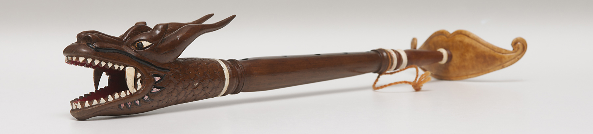

# Slompret -  Awikworks

## Inspiration

The inspiration for this module comes from two interconnected cultural references: the **dragon (naga) imagery found in Thai art and mythology**, and the traditional **Slompret**, a blowing instrument from East Java, Indonesia, which is often crafted in the form of a dragon's head.

The traditional Slompret is played by blowing air through the instrument's body, allowing sound to emerge from the dragon-shaped mouth. Its expressive form, combining mythological symbolism and acoustic performance, serves as the conceptual foundation for this project.

The **Slompret** reinterprets this traditional blowing instrument as an electronic sound device. Rather than producing sound through an acoustic resonator, the instrument uses a **CMOS CD4093 Quad NAND Schmitt Trigger** circuit to generate chaotic oscillations, noise textures, and breath-responsive sonic behaviors.

By merging Southeast Asian cultural heritage with DIY electronic instrument design, the Slompret Synthesizer explores new possibilities between folklore, open-source hardware, experimental music, and collaborative making.

---

## A 4093-Based Blowing Synthesizer

Embodying the DIWO (Do It With Others), this design interfaces with open-source hardware documentation hosted on Inspired by the [J'aime 4093 Nandsynth](https://www.hackteria.org/wiki/J%27aime_4093_Nandsynth), specifically drawing from the architecture of the Taime 4093 Nandsynth. Ready your soldering iron to convert this schematic into a responsive, low-voltage sonic engine.

---

## BOM

| No | Component                    |
| -- | ---------------------------- |
| 1  | 3.5 mm Audio Socket          |
| 2  | 47 µF Electrolytic Capacitor |
| 3  | Potentiometer                |
| 4  | CD4093 IC                    |
| 5  | Potentiometer                |
| 6  | 330 Ω Resistor               |
| 7  | LED                          |
| 8  | 100 nF Capacitor             |
| 9  | 0 Ω Resistor (Jumper)        |
| 10 | PCB                          |
| 11 | 330 Ω Resistor               |
| 12 | S9014 Transistor             |
| 13 | 10 kΩ Resistor               |
| 14 | S9014 Transistor             |
| 15 | 1 MΩ Resistor                |
| 16 | 1 µF Capacitor               |
| 17 | 4.7 kΩ Resistor              |
| 18 | 0 Ω Resistor (Jumper)        |
| 19 | 47 µF Electrolytic Capacitor |
| 20 | Electret Microphone          |
| 21 | DC Power Connector           |

---

2026-Awikworks
Arai-Eek CoLabs
Chiang Mai-Thailand
